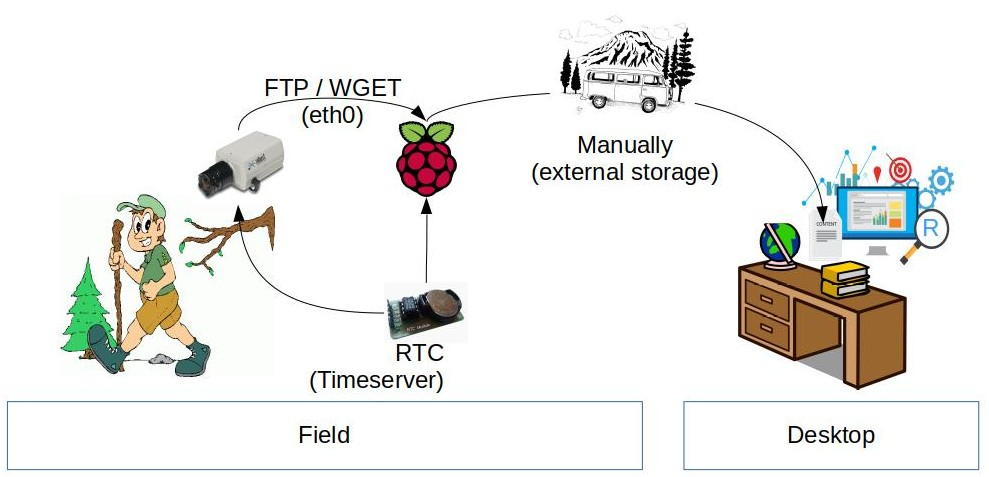
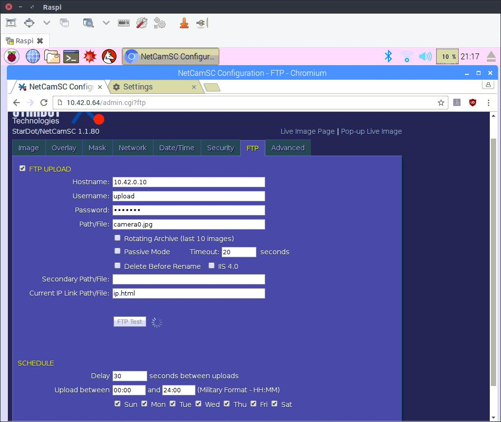

# Setup 2
As discussed with Johannes Schamel, Manuel Engelbauer and Niklas Scheder on 2.2.2016 internet is not always available in the field. They prefer an autoneus setup storing images locally. The setup should depend only on energy supply. The researchers would go into the field to collect the data.  

## Technical Concept


IP Adresses:
Stardot: 10.42.0.64
Raspberry: 10.42.0.10


## How to access Stardot?
### Portforwarding
Forward stardots web-backend to your local maschine (ubuntu laptop).  
Make sure `<startdor-ip>:80` (the configuration backend of stardot) is pingable from raspi. Now start [new ssh session](https://help.ubuntu.com/community/SSH/OpenSSH/PortForwarding#Local_Port_Forwarding) from laptop with `ssh -L 8080:10.42.0.64:80 pi@raspberrypi.local`. This will forward the stardot webinterface to your local maschiene. After loging into ssh open a browser and open `localhost:8080` -> should be the camera backend. (If you have troubles contact me, I had too)  


### VNC (Virtual Network Computing)
**Only works with PIXEL Enviroment**  
To access the camera in the field, *VNC* can be used:

> VNC is a graphical desktop sharing system that allows you to remotely control the desktop interface of one computer from another computer or mobile device. It transmits the keyboard and mouse, or touch, events from the controller, and receives updates to the screen over the network from the remote host.  
> You will see the desktop of the Raspberry Pi inside a window on your computer or mobile device. You'll be able to control it as though you were working on the Raspberry Pi itself.  
> --[raspberrypi.org](https://www.raspberrypi.org/documentation/remote-access/vnc/)  

  

Enable VNC Server using `sudo raspi-config`, Navigate to **Advanced Options**. Scroll down and select **VNC > Yes**.  

Installation:  
```
sudo raspi-config
select Advanced Options
select VNC

sudo apt-get install tightvncserver
```

Start VNC-session. When initial run set passwords here. Anser *Would you like to enter a view-only password (y/n)? * with `n`. Troubleshoot: Reset configuration by `rmdir ~/.vnc/`.
```
vncserver :1
```

CRON
`@reboot tightvncserver:1`


## Data Transfer
### Push via FTP
Currently the Stardot is on `10.42.0.54`. Connecting via vnc works. Configure and test FTP:


### Pull via `wget`
Current image at static adress.  
`wget -O now.jpg http://10.42.0.64/nph-jpeg.cgi`

## ToDo 
###Use RasPi-RTC as timeserver for Stardot
