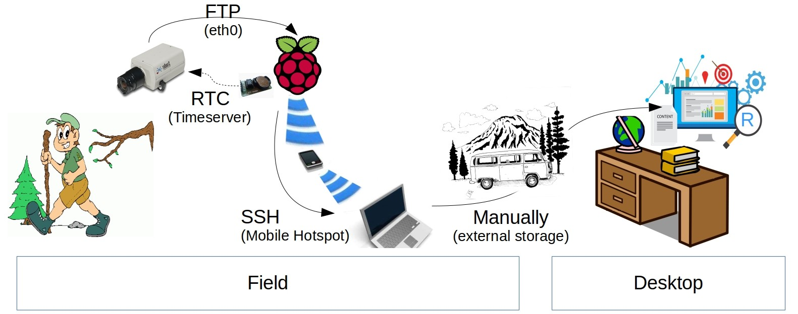
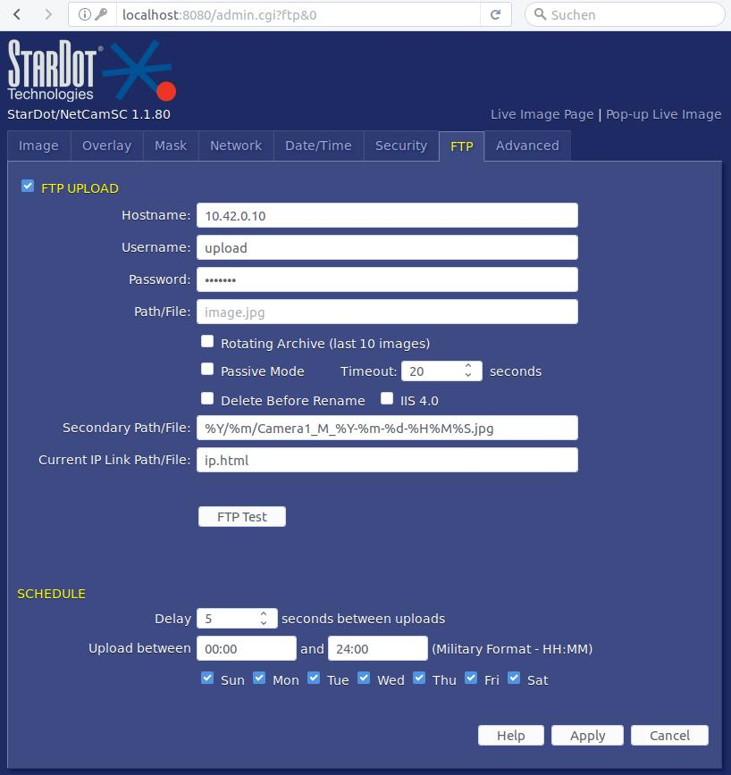

# Setup 2
As discussed with Johannes Schamel, Manuel Engelbauer and Niklas Scheder on 2.2.2016 internet is not always available in the field. They prefer an autonomous setup storing images locally. The setup should depend only on energy supply. The researchers would go into the field to collect the data.

## Technical Concept

IP Adresses:  
Stardot: 10.42.0.64  
Raspberry: 10.42.0.10  

## Maintenance
To access the instrument remotely proceed as follows:

### 1. Launch Mobile Hotspot
Use your smart-phone to host a little wifi hotspot. Attention: `SSID` and `WPA-Key` have to be [configured on RaspberryPi](../raspberry/system_settings.md#add-to-wifi)!

### 2a. Download Data via FTP
You can directly download the data an FTP client as configured below.

### 2b. SSH + Portforwarding Stardot
Full access to RaspberryPi and Stardot's web-backend. by forwarding the latter to your local machine (ubuntu laptop).  
 Now start [new ssh session](https://help.ubuntu.com/community/SSH/OpenSSH/PortForwarding#Local_Port_Forwarding) from laptop with `ssh -L 8080:10.42.0.64:80 pi@raspberrypi.local`. This will forward the Stardot web-interface to your local machine.  
After logging into ssh open a browser and open `localhost:8080` -> should be the camera back-end. If you can not access the camera make sure `<startdor-ip>:80` (the configuration backend of stardot) is pingable from raspi itself. Alternative to ping, you can also pull the current image with `wget -O now.jpg http://10.42.0.64/nph-jpeg.cgi`.

## Configuration
### Archive Images via FTP
For handling large data archives easily, it is recommended to store the images in a chronological folder structure. Therefore configure Stardot and Raspberry as follows.

#### Stardot
The Stardot is comes with a full FTP client out of the box and pushes new images onto the RaspberryPi. Currently it's [configured](localhost:8080/admin.cgi?ftp&0) to take a picture every minute (24/7) and write them into monthly folder.  

Set secondary Path/File to `%Y/%m/Camera1_...`.  

Attention: The monthly folders have to already exist on the server, they will not be created automatically. Also make sure the ftpuser has writing rights. Otherwise no images will be stored.

  

#### RaspberryPi
As mentioned above it is obligatory to provide the monthly folder structure on the server side (raspberrypi). Therefore CRON [this script](../raspberry/CRON_Monthly-Folder-Structure.sh) every month (`@monthly sudo bash ../raspberry/CRON_Monthly-Folder-Structure.sh`). It will `mkrdir ./YEAR/MONTH/` and permit `ftpuser` to write files in it.  

## Timeserver (Opt.)
Since we are doing time-series analyses the timestamps have to be accurate. In this case the timestamps are assigned by the camera when taking the picture. It defines the filename (See above Stardot configuration) and is printed to the upper left corner of every image.  Consequently the camera has to know the accurate time. While the devices are connected to the Internet they will be able to set their clocks correctly using NTP.

Unfortunately the two devices both trust on online timeservers only. When rebooting the instrument in an offline environment they can not sync with timeservers and the timestamps will be wrong. Instead they continue with the date they had been shutdown making it very hard to retrospectively identify the temporal gap as well. For operating in an offline environment a physical clock is necessary. A *real time clock* (RTC) module with a standalone battery has to be attached to the RaspberryPi. Then the camera is configured to trust on the RaspberryPi time and the images are named accurate.

**Stardot**:
Enter [Stardot Backend -> Date/Time](http://localhost:8080/admin.cgi?datetime), toogle `Automatic` and enter ip-adress of RaspberryPi.  

**RaspberryPi**:
Here you can find [infos](http://www.raspberry-pi-geek.de/Magazin/2015/03/Echtzeituhr-Modul-DS3231-sorgt-fuer-genaue-Zeitangaben),
a [configuration guide](http://raspberrypi.tomasgreno.cz/ntp-client-and-server.html)
and an exemplary product from [Amazon](https://www.amazon.de/DIYMall-Raspberry-DS3231-Uhrzeit-Knopfzelle/dp/B0126GGFQI)

## Powersupply
Stardot	12V * 0.5A  
RasPi	 5V * 1A  
