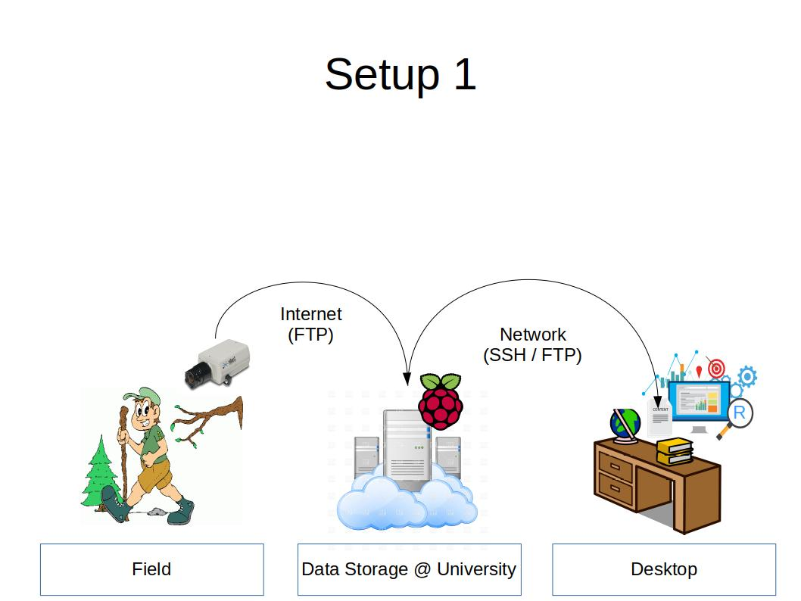

# Setup 1
The initial setup trusts on the Stardot camera beeing connected to the internet all the time. This is the case when it's mounted to building and connected to the local router and the advantages of Stardot Netcam SC come into play.  
This setup is comparable to the *weucam* concept.  

## Technical Concept
The camera comes with integrated webtechnologies and uploads new images to a server via *File Transfer Protocol* (FTP) periodically. As discussed with Simon Sebold (IT manager at LSFE) the server could be either a RasPi integrated within the UniWü network or a VM.   

### Integrate in UniWü Network
Indoor use () / Oder VM verwenden?

MAC Adressen:
