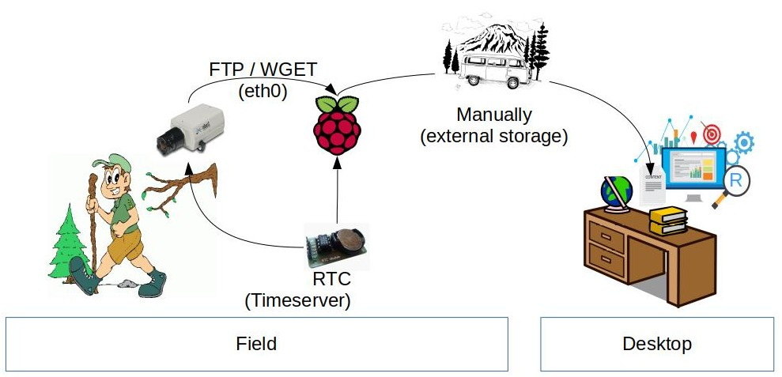

# Setup 2
As discussed with Johannes Schamel, Manuel Engelbauer and Niklas Scheder on 2.2.2016 internet is not always available in the field. They prefer an autoneus setup storing images locally. The setup should depend only on energy supply. The researchers would go into the field to collect the data.  

**Therefore we need a RTC for RasPi!!**

## Technical Concept

IP Adresses:
Stardot: 10.42.0.64
Raspberry: 10.42.0.10

## VNC (Virtual Network Computing)
To access the camera in the field, *VNC* can be used:

> VNC is a graphical desktop sharing system that allows you to remotely control the desktop interface of one computer from another computer or mobile device. It transmits the keyboard and mouse, or touch, events from the controller, and receives updates to the screen over the network from the remote host.  
> You will see the desktop of the Raspberry Pi inside a window on your computer or mobile device. You'll be able to control it as though you were working on the Raspberry Pi itself.

> --[raspberrypi.org](https://www.raspberrypi.org/documentation/remote-access/vnc/)

Enable VNC Server using `sudo raspi-config`, Navigate to **Interfacing Options**. Scroll down and select **VNC > Yes**.

**TODO: Try `vncserver` (without installing tightvncserver)**

## Data Transfer
### Push via FTP
Currently the Stardot is on `10.42.0.54`. Connecting via vnc works. Configure and test FTP:

### Pull via `wget`
Current image at static adress.  
`wget -O now.jpg http://10.42.0.64/nph-jpeg.cgi`

## ToDo
### Portforwarding Camera
 
 
###Use RasPi as timeserver for Stardot
