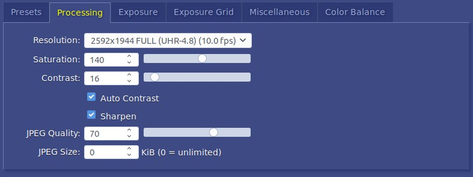
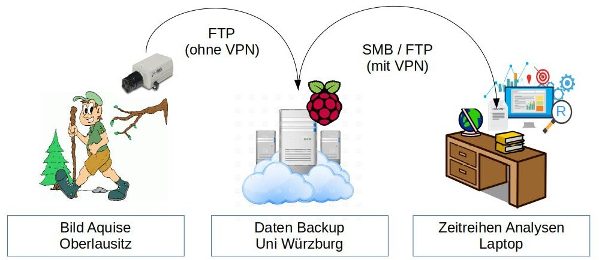
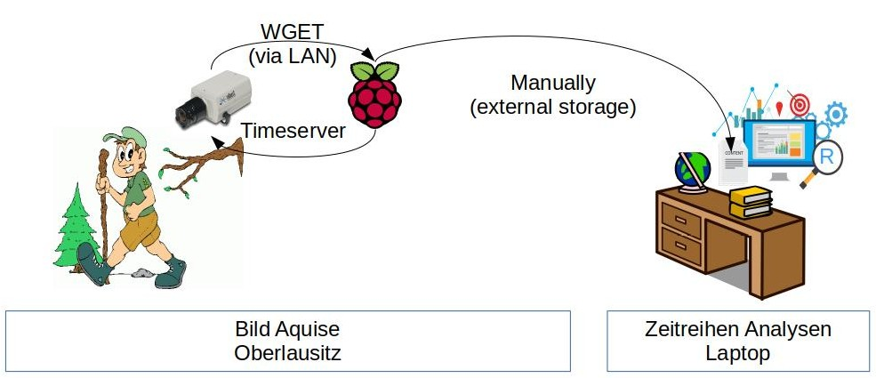

# Hardware

## Stardot Cameras

### Access Configuration Back-end
1. Connect Camera to Laptop. Identify IP by typing `cat /var/lib/misc/dnsmasq.leases`
2. Access `10.42.0.64` (netcamsc) via browser
3. Click `config`. Password admin.
4. Fix IP Adress: RED 123.45.67.1

### Image optimization
1. Hardware Focus: To focus the camera loosen the screw on top of lense, then gently turn the very first bit of the lense (not the ring with screw on). Turn left for close objects, right for far.  
2. Select Resolution and JPEG Quality  
  
3. Select Exposure Grid   

## RaspberryPi 3
> The Raspberry Pi Foundation is a charity. All the money we make from selling computers, cases, cameras, and other products goes straight into our charitable fund to train teachers, provide free learning resources, teach kids, help build the foundations of digital making in schools, and much more.
> -- [Official RaspberryPi website](www.raspberrypi.org/)

### Download Operating System
*Raspbian* is a free operating system optimized for the Raspberry Pi hardware. This *Debian* based *Linux* is has a big online community, is well tested and thousands available packages using *apt*.  
Here we downloaded the latest [*Raspbian Jessie Lite*](https://www.raspberrypi.org/downloads/raspbian/), released on 11th January 2017 with kernel version 4.4. I choose the lite version without the *PIXEL desktop* to save unnecessary disk space for archiving images. After writing the iso-image on the SD-Card using [Ubuntu's USB-Creator](https://wiki.ubuntuusers.de/Live-USB/#USB-Creator-Startmedienersteller).  

### Getting Started with SSH only
I don't have an external screen and get started using SSH only. Please see this [dedicated post](./raspberry/getting_started_ssh_only.md).  

### Initial configuration
For initial configurations open the [Raspberry Pi configuration tool](https://www.raspberrypi.org/documentation/configuration/raspi-config.md) as superuser: `sudo raspi-config`.  

#### Password
See `Passwords.md` (Obvious not in Git)  

#### Locale
1. Choose `4 Internationalisation Options`
2. ~~Change Locale to German UTF8~~ I'm fine with english
3. Change Timezone to Europe/Berlin
4. Change Wi-fi Country to `DE Germany`

#### Update
As seen with the failed Telekom-Hack the internet-of-things is tageted  by botnets. An up-to-date system prevents harm to the system and others. To close latest exploits update the system by typing `sudo apt update` followed by `sudo apt upgrade`.

### Install Additional Packages
* R
* dns??

### Duplicate SD-Image
Identical configuration for both RasPis...  

1. Place configured RasPis SD-Card in Laptop. Create Image
2. Place empty SD-Card into laptop. Write Image

The images also specify the disc size. To make the rest of the 64GB available for files it has to be expanded. Make sure the sd-image is completly pre-comfigrured before next steps (after expanding the image as created above will be 64GB no matter how many disc-capacity acctually is used!)

1. Place pre-configured image in RasPi and boot
2. `sudo raspi-config`
3. **Expand Filesystem**...
4. `reboot`

# Setup 1
The initial setup trusts on the Stardot camera beeing connected to the internet all the time. This is the case when it's mounted to building and connected to the local router and the advantages of Stardot Netcam SC come into play.  
This setup is comparable to the *weucam* concept.  

## Technical Concept
The camera comes with integrated webtechnologies and uploads new images to a server via *File Transfer Protocol* (FTP) periodically. As discussed with Simon Sebold (IT manager at LSFE) the server could be either a RasPi integrated within the UniWü network or a VM.   

### FTP Upload
How/where to upload images to. Kameras stehen im Gelände, ohn OPENVP.

### Integrate in UniWü Network
Indoor use () / Oder VM verwenden?

MAC Adressen:

## Setup 2
As discussed with Johannes Schamel, Manuel Engelbauer and Niklas Scheder on 2.2.2016 internet is not always available in the field. They prefer an autoneus setup storing images locally. The setup should depend only on energy supply. The researchers would go into the field to collect the data.  

**Therefore we need a RTC for RasPi!!**

### Technical Concept

1. Connect RasPi w. Stardot via LAN
2. Fix IP?
3. PortForwarding 

**Use RasPi as timeserver for Stardot**

### Wget current image
`wget -O now.jpg http://10.42.0.64/nph-jpeg.cgi`

