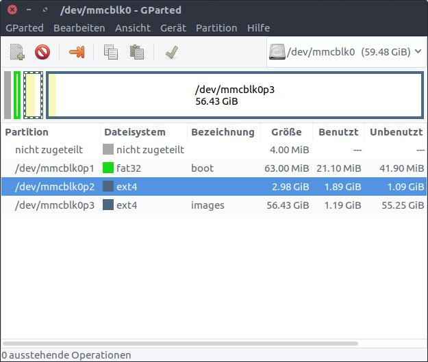

# Backing up Pi images

## Partitions

1. `/boot/` Boot partition. Do not touch 
2. `/..../` Systempartition. Software is located here.
3. `/images/` Upload images here. Not part of image

Drop Images

## Backup current Image

**Attention: [Partitionsnames can change](https://wiki.ubuntuusers.de/dd/)!**
``
date
sudo dd if=/dev/mmcblk0p1 of=./raspberry-image_1_boot.img
sudo dd if=/dev/mmcblk0p2 of=./raspberry-image_1_system.img
~~sudo dd if=/dev/mmcblk0p3 of=./raspberry-image_1_images.img~~
``

## Write existing Image

## Mount partition `/mnt/images/`

**reloop to have an image including mounted `mnt/images/`**

# Todo Stardot
Place secondary filename

Place Enricos Files in general