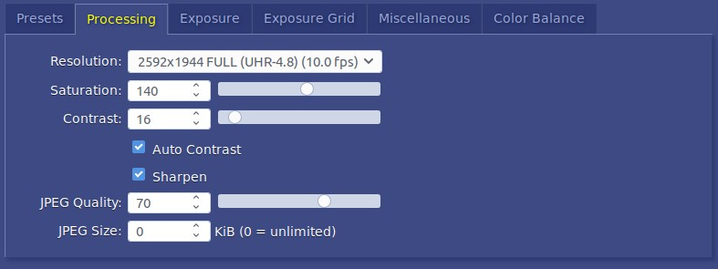
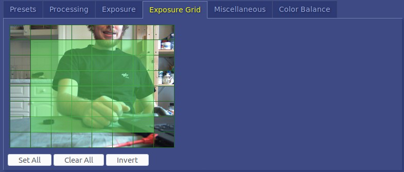
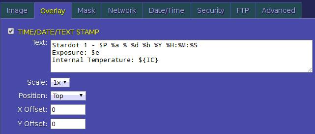

# Stardot Cameras

## Fix IP
Was `10.42.0.64` since initialisation.

## Access Configuration Back-end

1. Access `10.42.0.64` (netcamsc) via browser
2. Click `config`. Password admin.

## Image optimization
1. Hardware Focus: To focus the camera loosen the screw on top of lense, then gently turn the very first bit of the lense (not the ring with screw on). Turn left for close objects, right for far.  
2. Select Resolution and JPEG Quality  
  
3. Select Exposure Grid
  

## Configuration
See Handbook.

### FTP
See [Setup 2](../2_setup/setup2.md)  

### Overlay
  
