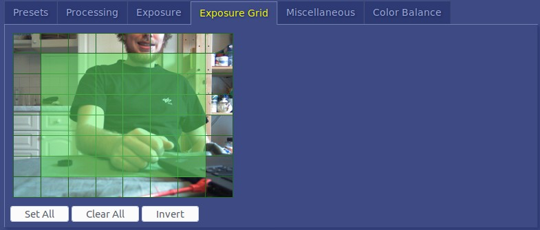
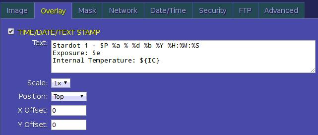

# Stardot Cameras

## Fix IP
Was `10.42.0.64` since initialisation.

## Access Configuration Back-end

1. Access `10.42.0.64` (netcamsc) via browser
2. Click `config`. Password admin.

## Image optimization
1. Hardware Focus: To focus the camera loosen the screw on top of lens, then gently turn the very first bit of the lens (not the ring with screw on). Turn left for close objects, right for far.  

2. Select Resolution and JPEG Quality  
  

3. Select Exposure Grid
  

## Configuration
You can find the complete hadbook [here](192.208.239.229/kb/index.php?View=file&EntryID=63)

### FTP
See [Setup 2](../2_setup/README.md)  

### Overlay
An image overlay writes meta-data into the image. This can be useful in case something went wrong with the filename or to read exposure times for NDVI analyses..
  
